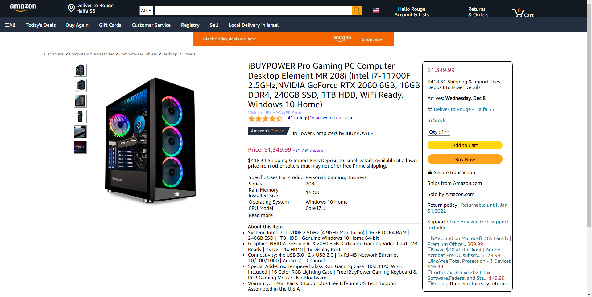
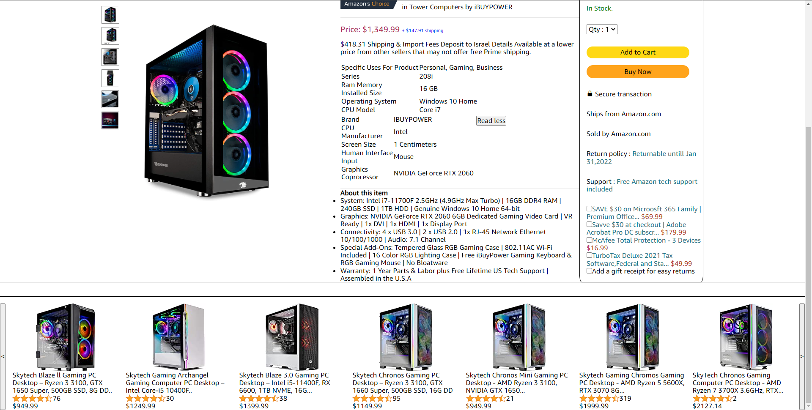

# Amazon-Project

[Live Demo: Amazon Mockup](https://rougenij-amazon.netlify.app/)
------------------

### This Project written by using HTML CSS & Javscript

The idea behind this project was to find how pixel perfect a mockup site can be.
 

# Current state of the Chatting App Project :
---------------------------------

-------------------------------------

------------------------------------

### CopyRight Claim

[Amazon](https://www.amazon.com/)

